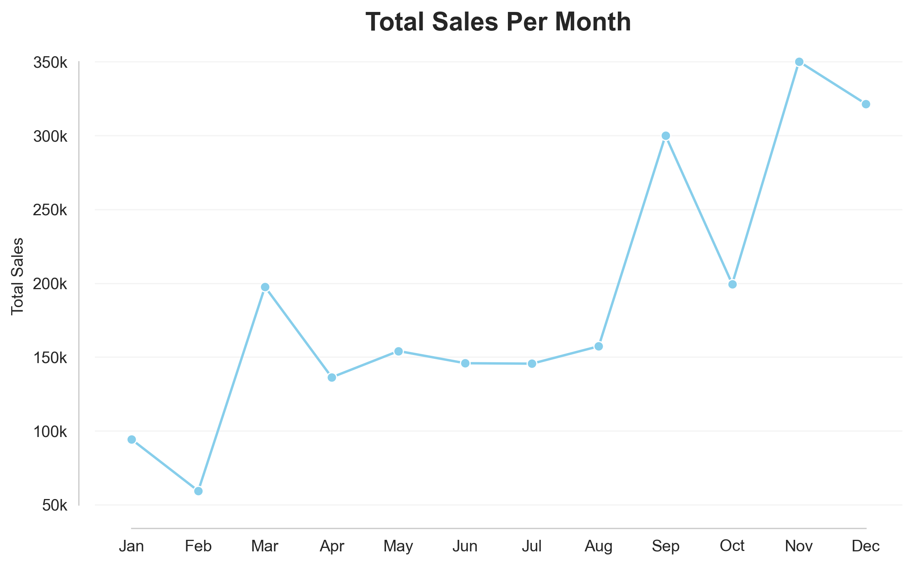
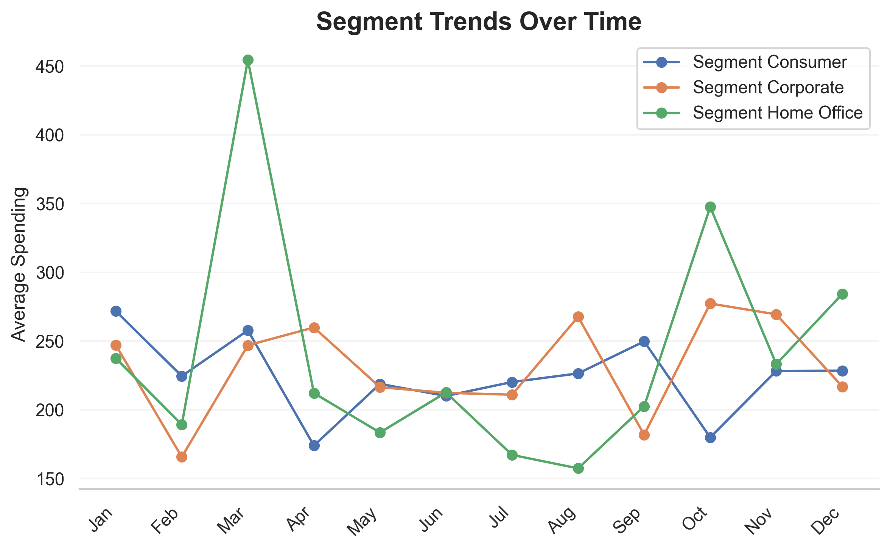
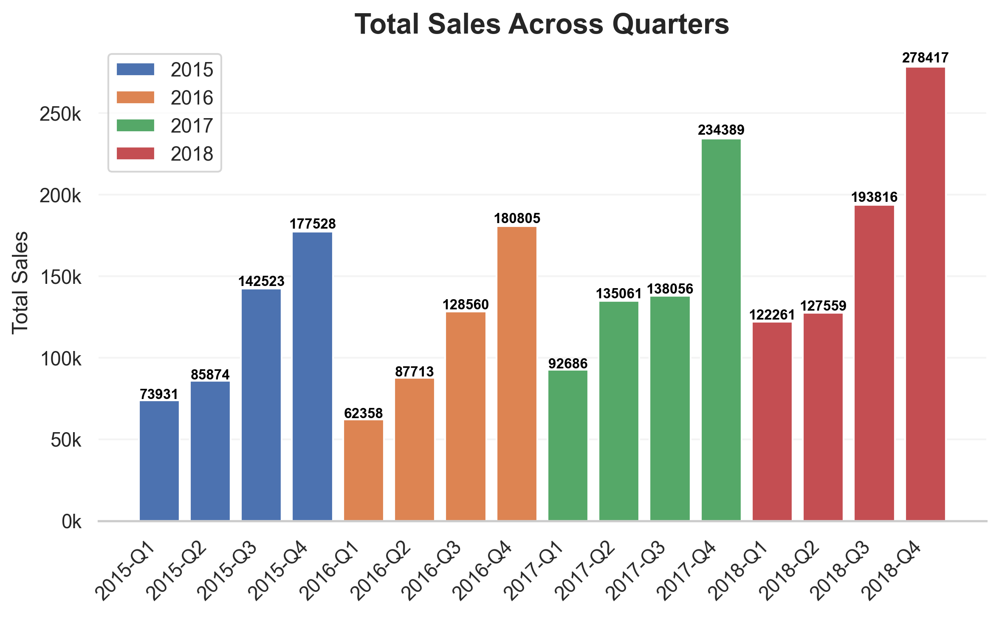
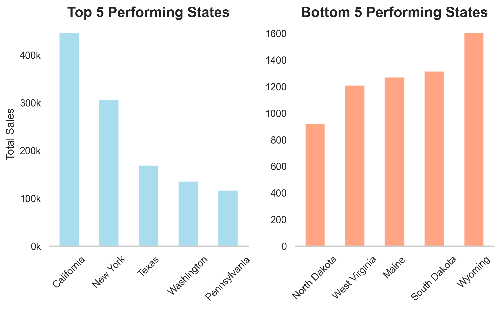
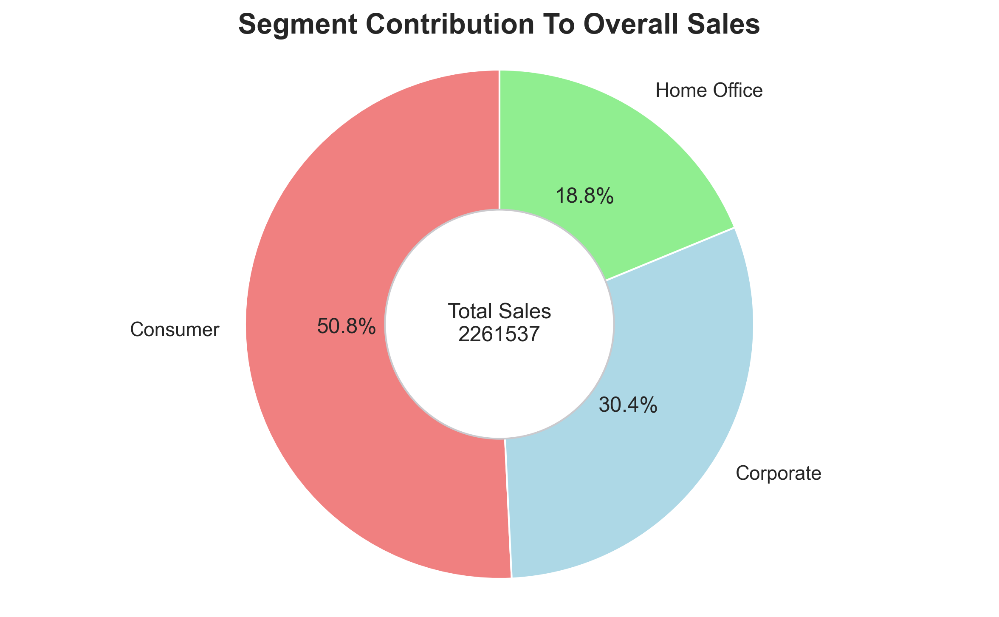
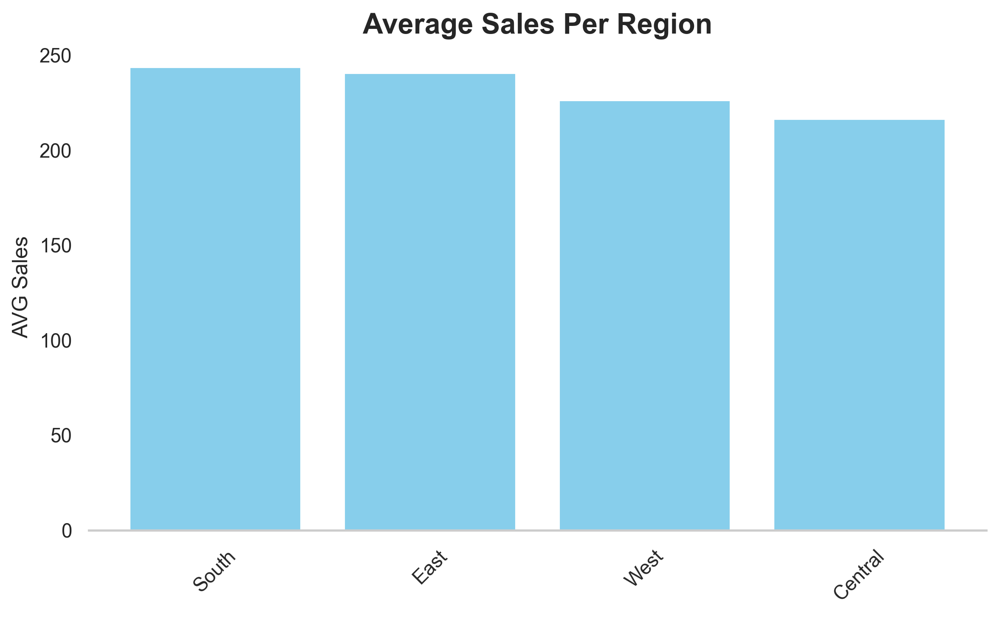
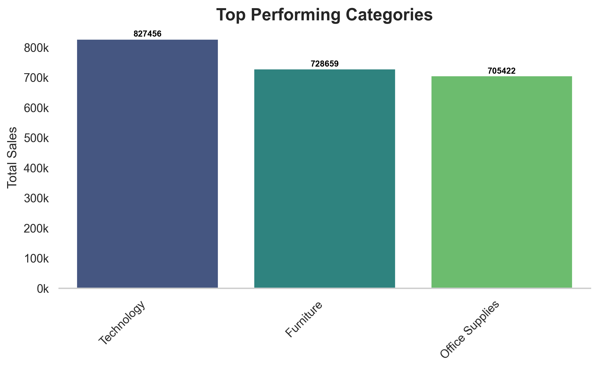
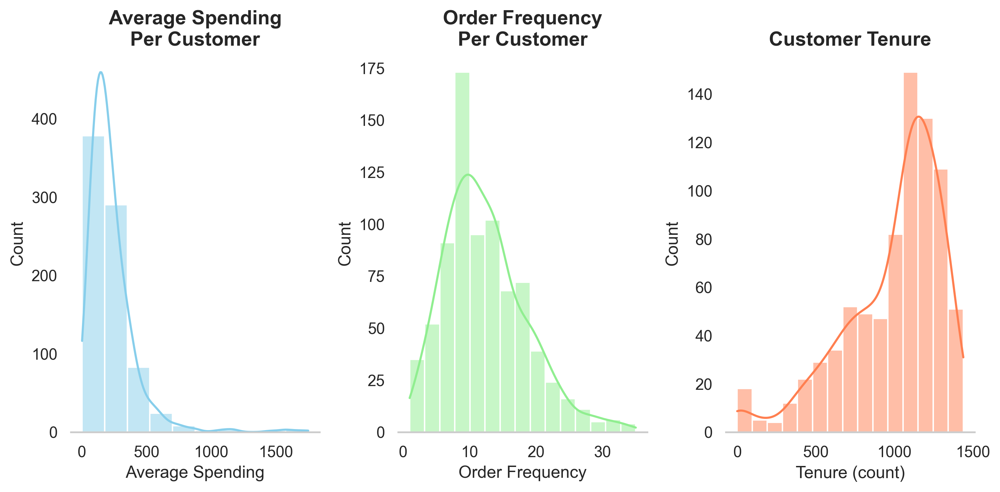
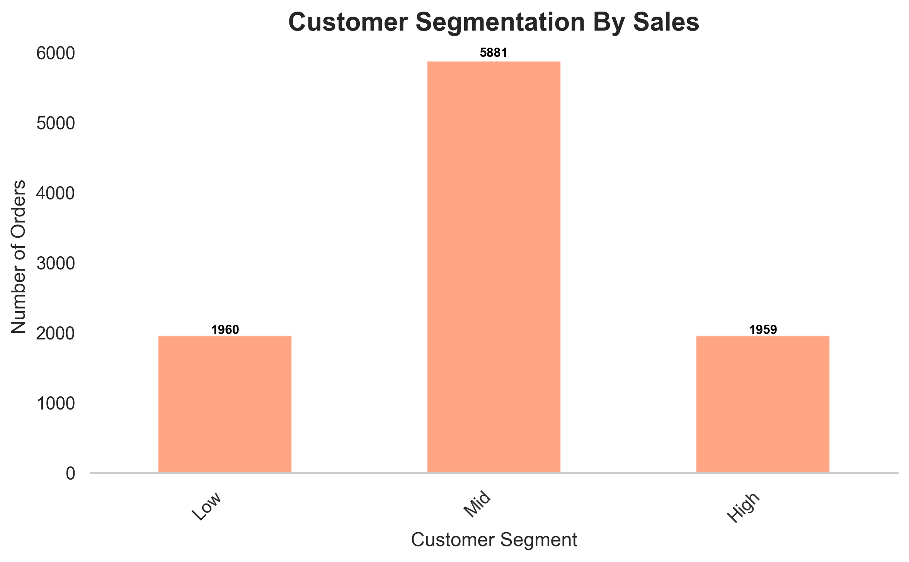
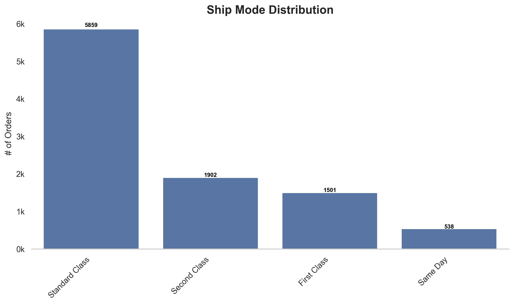

[EXPLORE DASHBOARD](https://saledashboard.streamlit.app/)
## Data Overview:

* Total Rows: 9800
* Total Columns: 18

### Time Period: 
* Data spans from January 2015 to December 2018

## Data Visualization:  

---

---

---

---

---

---

---

## Customer Behavior: 

---

## Customer Segment: 

---

## Additional Info:

___

## Sales Dashboard:
[EXPLORE DASHBOARD](https://saledashboard.streamlit.app/)
